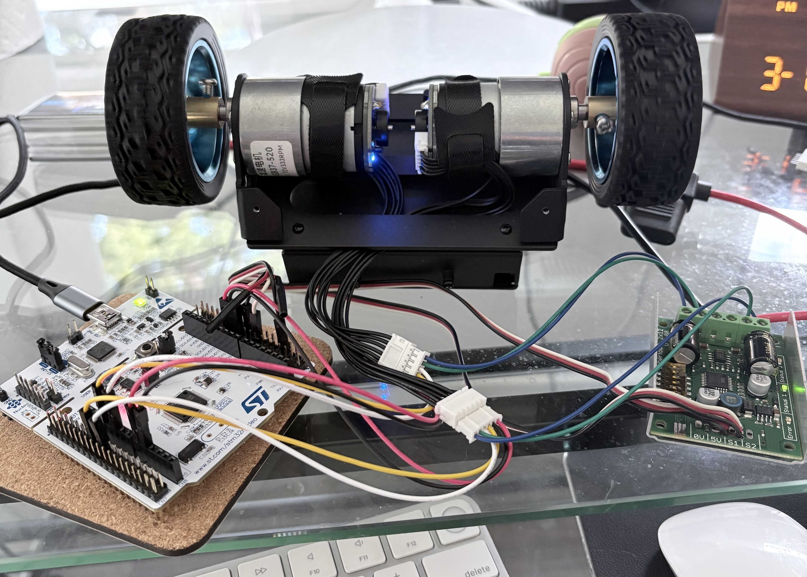
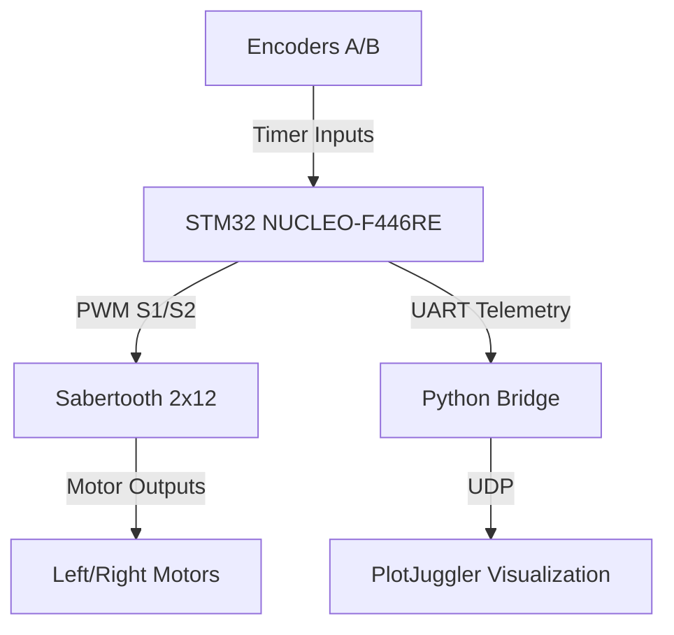

# Autonomous Robot Engineering System: Talos

  

**Talos** (named after the [bronze automaton from Greek mythology](https://www.theoi.com/Gigante/GiganteTalos.html)) develops a two-wheel self-balancing robot, inspired by professional systems. The architecture prioritizes hierarchical control: deterministic stability via an _STM32 microcontroller_, complemented by higher-level planning and telemetry on a _Jetson Orin Nano_. This design aligns with industry standards for scalable autonomy, enabling data-driven iteration and refinement.

The project applies embedded systems, control theory, and observability tools to bridge software engineering with robotics hardware, following a phased approach to systematically manage complexity.

## Hardware Overview
- **Chassis and Actuation**: [Yahboom 2WD kit](https://category.yahboom.net/products/sbr-chassis-kit) with [JGB37-520 encoder motors](https://www.aslongdcmotor.com/photo/aslongdcmotor/document/26547/37mm%20Round%20Spur%20Gear%20Motor_PDF00.pdf) and [Sabertooth 2x12 driver](https://www.dimensionengineering.com/datasheets/Sabertooth2x12.pdf).
- **Real-Time Controller**: [STM32 NUCLEO-F446RE](https://www.st.com/en/microcontrollers-microprocessors/stm32f446re.html) for inner-loop control.
- **High-Level Compute**: [Jetson Orin Nano](https://developer.nvidia.com/embedded/learn/get-started-jetson-orin-nano-devkit) for planning, vision, and logging.
- **Sensors**: [BNO055 IMU](https://www.bosch-sensortec.com/media/boschsensortec/downloads/application_notes_1/bst-bno055-an007.pdf) (integration in progress).
- **Power**: [3S LiPo battery](https://genstattu.com/bw/) with safety features.

  

## Phase 1: Independent Wheel Velocity Control
With wheels elevated for safety, this phase integrates encoders and implements per-motor PI control for precise velocity tracking. It establishes a foundation for balance, addressing asymmetries such as stiction and deadband variability.

Telemetry flows from the STM32 via [UART](https://en.wikipedia.org/wiki/Universal_asynchronous_receiver-transmitter) to a Python bridge, visualized in [PlotJuggler](https://plotjuggler.io/) for analysis. The plots demonstrate velocity errors converging under step references, with moving RMS metrics illustrating control performance.

  

Firmware is implemented in C using [STM32CubeIDE](https://www.st.com/en/development-tools/stm32cubeide.html). Custom modules handle encoder velocity estimation (quadrature timer-based ticks/sec computation, convertible to rad/s or m/s) and PI control (with integral limits, output clamping, and deadband compensation for stiction). The main loop initializes peripherals, executes PI steps at `~100 Hz`, applies PWM outputs, and logs metrics.

## Next Steps
Phase 2 adds IMU-based state estimation, advancing to STM32 balance control. Subsequent phases incorporate Jetson MPC, vision, and Foxglove-enabled simulation-to-topics testing with comparative analysis.

For architecture diagrams and wiring details, see `/docs`. Contributions or discussions welcome—open an issue.