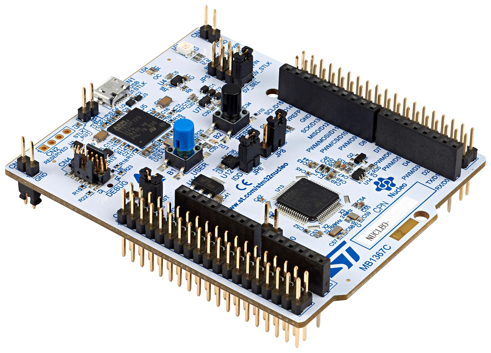

# Creating a new STM32 Project

  

## CubeMX
- New Board Selector -> NUCLEO-F446RE -> Start Project
- Project Manager -> Project Name, Location
  - Toolchain/IDE -> STM32CubeIDE
- Pinout & Configuration -> Timers
  - TIM1 -> Channel1 -> PWM Generation CH1
  - TIM4 -> Channel1 -> PWM Generation CH1
  - Configure timer settings
- Generate Code -> Verify `.ioc` created
- Close CubeMX

## CubeIDE
- File -> SMT32 Project Create/Import
- Import STM32 Project -> STM32CubeMX/STM32CubeIDE Project
- Import source -> location for CubeMX project -> Finish
- Under project name dir, open `Core/Src/main.c`